An undergraduated [Work-integrated learning](https://www.griffith.edu.au/enrich-your-studies/work-integrated-learning) project for my [Bachelor of Information Technology](https://www.griffith.edu.au/study/degrees/bachelor-of-information-technology-1538) degree.

The project delivers a Windows app that provides **interactive GUI**, **data processing**, and **data export** functionality from the client's raw data source, utilising [pandas](https://pandas.pydata.org/), an open-source data analysis library, and other supplementary [Python](https://www.python.org/) frameworks.

The project received [Finalist Place for The Best Innovative Project in Trimester 2, 2022](https://drive.google.com/file/d/1KgHNuUkKHJ_I-4aHQvx8IObYiW26RZeG) of the [FirstWave Awards](https://www.griffith.edu.au/griffith-sciences/school-information-communication-technology/industry/firstwave-awards).

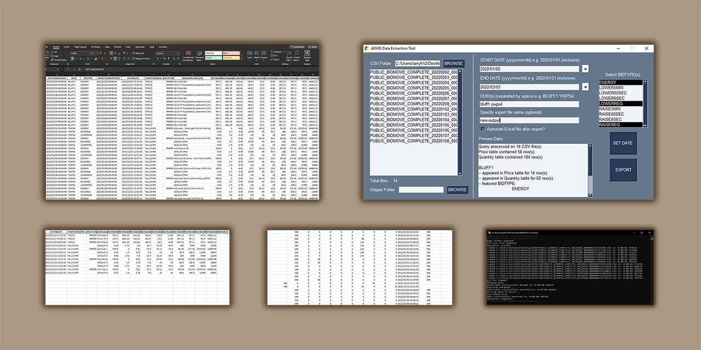

## Table of Content

- [Project Overview](#project-overview)
    - [Data Download Sources](#data-download-sources)
- [Application Features](#application-features)
    - [Import Data and Initial Filter](#import-data-and-initial-filter)
    - [Multiple Queries Filter](#multiple-queries-filter)
    - [Data Separation and Duplication Purge](#data-separation-and-duplication-purge)
        - [Stacked Raw Data Problem](#stacked-raw-data-problem)
        - [Data Duplication Problem](#data-duplication-problem)
    - [Output Data and Export](#output-data-and-export)
    - [Error Handling & Troubleshooting](#error-handling--troubleshooting)
- [Extras](#extras)
    - [Clone and Build](#clone-and-build)
        - [Install required packages](#install-required-packages)
        - [Build into executable](#build-into-executable)
        - [Small note about cloning and building from source](#small-note-about-cloning-and-building-from-source)
    - [Changelog and Releases](#changelog-and-releases)
        
## Project Overview

Client Details and Project Requirements

 

"The project will seek to develop an efficient and effective data extraction process for use by Griffith University’s Centre for Applied Energy Economics and Policy Research (CAEEPR) to extract band-based generator price and supply offer data supplied to the Australian Energy Market Operator (AEMO) as part of the wholesale market operations of the National Electricity Market (NEM).

This data includes coupled ($/MWh) price and MWh quantity data supplied to AEMO by generators over ten price/quantity bands that defines each generators piecewise-linear supply function offered to AEMO as required under the National Electricity Rules (NER).

The coupled band-based price/quantity data is released in a series of zip files containing csv files relating to supply offers of all generators competing in the NEM that are located in Queensland, New South Wales, Victoria, South Australia and Tasmania and includes thermal, hydro and renewable energy generators.

Information relating to the time and frequency of changes in the generator price and quantity bands is depicted in the csv files and would have to be extracted from time stamps included in the files that identify when changes occur and what price/quantity changes were invoked. Given the large number of generators involved, high frequency of changes, and substantial time over which the NEM has been running (since 1998), this project would be addressing a large data problem.

To-date, CAEEPR has not attempted to extract this data but realise it will be very valuable for future research undertaken at CAEEPR, principally permitting different bidding strategies linked to observed behaviour of generators to be investigated. Thus, the project team is likely to have considerable flexibility in determining how to extract this data, consistent with the broad CAEEPR objectives to be listed below.

The key objectives being sought by CAEEPR is: (1) a set of code that can read in the csv files obtained from AEMO; (2) extract the data in a convenient format to be determined by the project team in consultation with CAEEPR; and (3) enable a search to be undertaken to extract band-based supply-offer bids (e.g. both price and quantity couples) of one or more generators and with this extraction process being capable of writing the generator based data to an excel file.

Another key objective is to minimize 'hands on' activity required by CAEEPR staff in the actual extraction process. As mentioned above, a capability should be embedded in the software whereby CAEEPR staff can supply one or more generator identifiers consistent with AEMO identifier protocols and the band-based data is extracted and copied to an excel file for that generator or spreadsheets in an excel work file for a set of generators.

Another key objective of CAEEPR is optimising the efficiency of data extraction by improving the computing speed of the data extraction operation as well as memory utilization and management of this process, including storage options for the completed product - e.g., Dropbox, OneDrive or another server-based option.

Desirable Skills - CAEEPR has no pre-existing requirements although some experience with data analytics, coding/software development and information systems would be advantageous.

Additional Details - The skills and knowledge gained by the individual/team would be of particular interest to companies operating in the electricity industry including generation and network companies as well as Government regulatory bodies and departments.

There is also the prospect of post-graduate level projects particularly addressing Java program optimization to enhance the ability to employ Monte Carlo sampling methods and multi-threads or parallel processing within the structure of the current model software."

\- _CAEEPR (2022)_

### Data Download Sources

- [About AEMO Market Data - NEMWEB](https://visualisations.aemo.com.au/aemo/nemweb/index.html)
- [Daily Completed-bids Archive](http://nemweb.com.au/Reports/Current/Bidmove_Complete/)
- [Monthly Completed-bids Archive](http://nemweb.com.au/Reports/ARCHIVE/Bidmove_Complete/)

## Application Features

### Import Data and Initial Filter

The app can import multiple .csv files that match the AEMO name pattern `PUBLIC_BIDMOVE_COMPLETE_YYYYMMDD` from a parent folder. The app also scans for all children folder recursively to find all valid files.

Example folder structure:

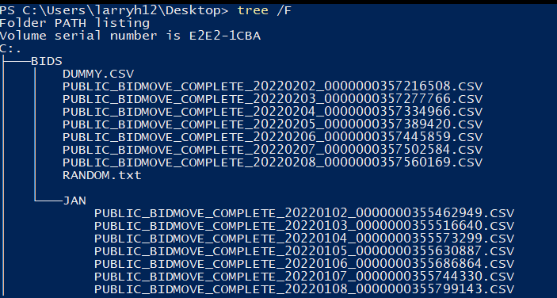

Import result:

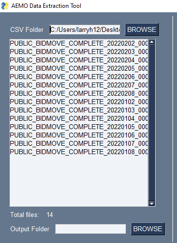

_(notice how `DUMMY.CSV` and `RANDOM.txt` are not imported)_

The user can proceed to narrow down the range of data using the intial date filter.

The user can enter the date input manually or use the built-in calendar.

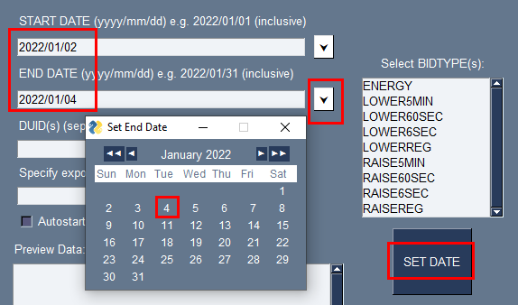

Filter result:

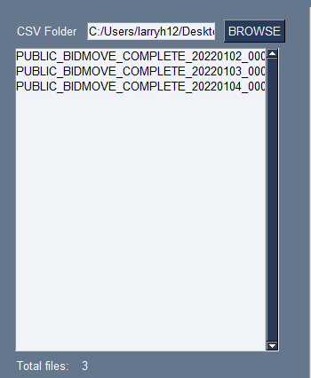

### Multiple Queries Filter

Per client requirements, the user can use a combination of multiple `Device Unit Identifiers (DUID)` and `BIDTYPE`.

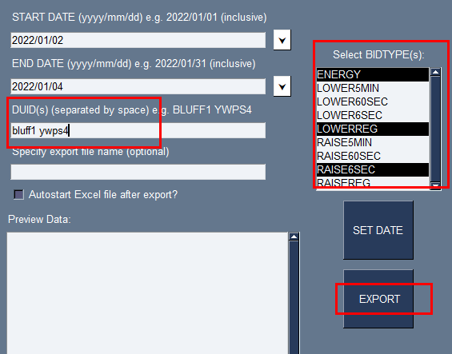

After clicking `EXPORT`, the user is prompted with a confirmation dialog and a brief overview of the expected data. This is to give the user a quick glance over the output and to double-check for any mistakes from the input, before proceeding to the actual export process.

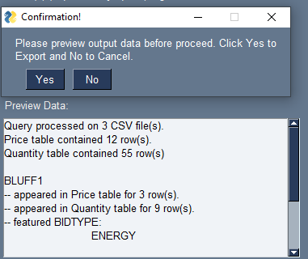

### Data Separation and Duplication Purge

#### Stacked Raw Data Problem

A single CSV file records 24-hour of bidding data. However, in each file, there are **two different tables** stacking on each other, that represent **two different data types**, which are the `bidding price` and the `MWh quantity` that form `"the coupled band-based price/quantity data"` _(see project overview for more details)_.

AEMO refers the two tables as `BIDDAYOFFER_D` and `BIDPEROFFER_D`. See the report definitions:

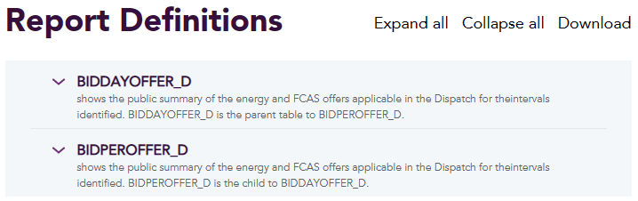

The cut-off point of the two tables is also different for each CSV file since the recorded data varied significantly everyday. For example, on `2022/01/02`, the cut-off occured at row `1292`.

The app attempts to dynamically identify and separate the two different data tables. In the case of multiple CSV input, _i.e. 1-week range (7 files)_, the process is each applied **chronologically** to individual file _(1-day data)_, before compiling all the **post-processed** data into a final output.

Example output:

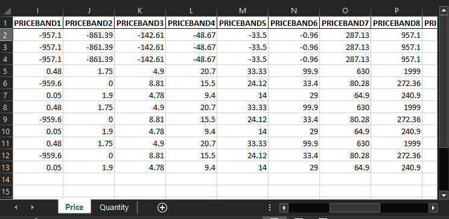

_(notice how the `Price` sheet displays `PRICEBAND` for bidding price data, while the `Quantity` sheet displays `BANDAVAIL` for the MWh quantity data)_

#### Data Duplication Problem

The AEMO records and updates data in a 5-minute interval regardless of changes occured. Every 5 minutes, if there is no data change, there will be **at least** one entry added per **one** `DUID` and **one** `BIDTYPE`.

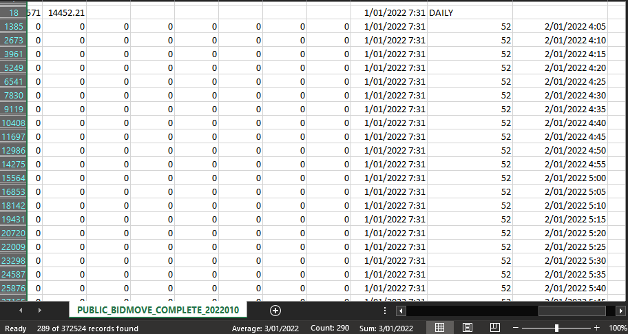

However, since there are well over 1000 unique `DUIDs` being monitored daily, this results in a raw CSV with over **300,000** entries **per day**, each file takes around **70MB** of disk storage.

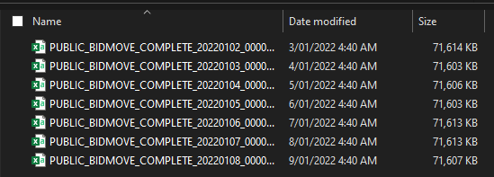

Although equipped with a large mount of data, most of the raw CSV provide little to no useful information, since it is very difficult to detect actual data fluctuation and draw meaningful insight, as the frequency of data change is rather small _(not to mention there are repeated entries for `BIDTYPE` as well)_.

It is estimated that only around **1%** of the data entries present useful information to the client while the rest **99%** are bloated duplication.

The app aims to solve this problem by detecting and filtering out non-changing entries, by checking a combination of different attributes such as `LASTCHANGED`, `BANDAVAIL`, `PRICEBAND`, etc.

An example query of 2 `DUID` and 3 `BIDTYPE` in a range of 3 days _(over **1 million** rows of raw data)_ returns a **12KB** Excel file _(size reduced nearly by **18000 times** from 3 raw CSVs)_ with a total of **69** rows for both price and quantity data _(about **96%** debloated)_.

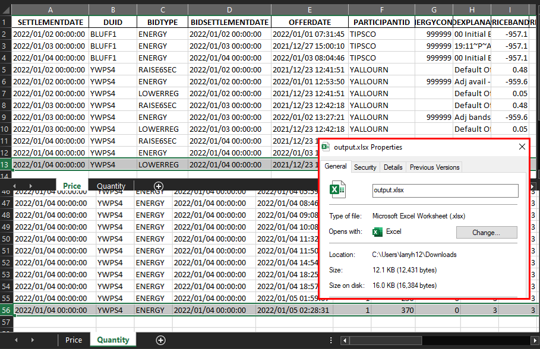

### Output Data and Export

For client requirements, the app exports to Excel `.xlsx` file format.

The app provides _optional_ features to specify a custom output file name **and/or** a custom save folder location. If both options are left empty, by default, an `output.xlsx` will be generated at the same folder that the app is run from.

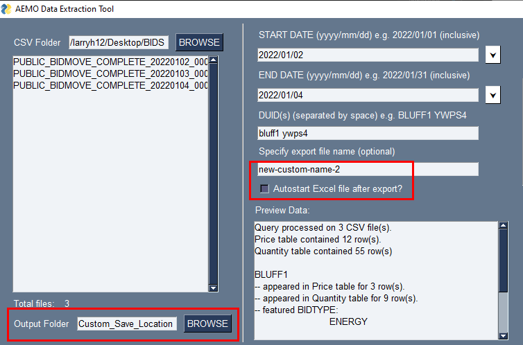

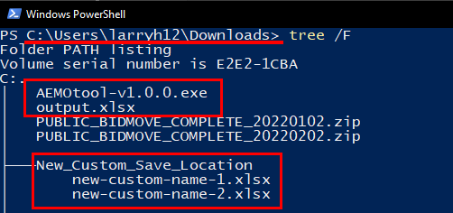

Please be aware that in most cases, the app will attempt to **overwrite** any existing `.xlsx` files that have the **same** file name.

For example, if you leave custom name empty, any subsequent run of the app will export to a single `output.xlsx` file, and the data from previous runs will be **overwritten** by the new output data.

Thus, it is highly recommended to specify an unique custom name for each run to avoid data loss.

### Error Handling & Troubleshooting

- ##### Anything actions when no root folder is specified
    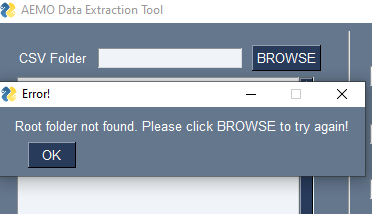
- ##### Wrong date format
    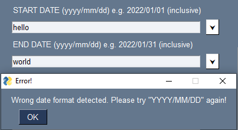
- ##### Try export with no CSV
    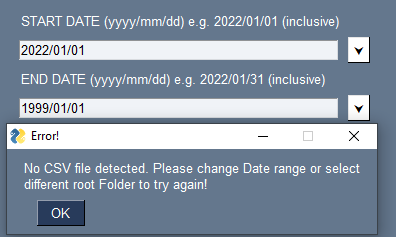
- ##### Check for empty output
    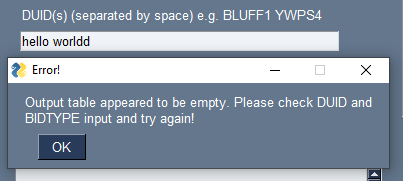
- ##### Q: What happens if you leave DUID input empty?
  A: The app exports **all** `DUID` data, but after duplication purging of course. This is also a good method to only trim/debloat the raw table without the need to inspect specific `DUID(s)`.
- ##### Q: What happens if you leave BIDTYPE input empty?
  A: Same with `DUID`. Again, selecting a single `DUID` while leaving `BIDTYPE` empty will export **all** bid types for that specific device ID.
- ##### Q: I tried exporting all DUID but the output was not sorted chronologically as you mentioned?
  A: The client required the output to be grouped by `DUID`. So, for export of multiple device IDs with a period more than 1-day, the output will **first** be grouped into sections by `DUID`, **then** in each `DUID` block, the rows are **sorted** by `SETTLEMENTDAY` aka chronological order.
- ##### Q: I tried putting the character "/" in the output file name but it got omitted?
  A: For now, the app will trim out "troublesome" character(s) in the output section, the character "/" which has the side-effect of creating new child folder instead of exporting the file, is one example. So, it is recommended to name your file with alphanumeric characters only to avoid unintended behaviours.

## Extras

### Clone and Build

You can clone the source code with the following command to start debugging / testing ([git-scm for Windows](https://git-scm.com/) is required):

    git clone https://github.com/larryh12/gu-capstone-2022-caeepr.git

#### Install required packages

The source code provides the `1_init.bat` script to install the required Python packages, in order to build and run the app. Latest version of [Python](https://www.python.org/downloads/) and [pip](https://pypi.org/project/pip/) is highly recommended.

Just double-click to run the script. If there are issues, try right-click and `Run as administrator`.

Here are the list of the packages used for this project:

- [pandas](https://pandas.pydata.org/) and [NumPy](https://numpy.org/) for data processing.
- [PySimpleGUI](https://www.pysimplegui.org/) for the GUI.
- [openpyxl](https://openpyxl.readthedocs.io/) for exporting dataframe to Excel output.
- [PyInstaller](https://pyinstaller.org/) for building the source code into a Windows executable.

#### Build into executable

The source code provides the `2_build.bat` script to build the source into a Windows `EXE` file.

The script use `PyInstaller` package to build from the source code, so make sure to have it already installed, either manually or running the `1_init.bat` script first.

Also, make sure to have the batch scripts in the same directory as both `App.py` and `GUI.py`.

#### Small note about cloning and building from source

The original purposes of these scripts were to aid development process and provide my teammates the option to quickly setup the dev environment on their machines to start debugging and testing.

Although it had been tested to work on my teammates' and client's machines, it is not guaranteed to work as expected on your local machine / environment, as there will be some differences in each machine Python setup, system PATH scope, permissions, etc.

Again, building the source code is not a common practice for most users unless you are interested in debugging and/or testing. If you run into issues, I would highly recommend trying our pre-built executable releases from the source below.

### Changelog and Releases

To get the pre-built `EXE`, see our [Releases](https://github.com/merrecdarkin/Wil-Project-AEMO-CSV-Efficient-Reading-Sorting-and-Export-/releases)

To get more into the technical implementation, see our [Pull requests](https://github.com/merrecdarkin/Wil-Project-AEMO-CSV-Efficient-Reading-Sorting-and-Export-/pulls?q=is%3Apr+is%3Aclosed) and [Issues](https://github.com/merrecdarkin/Wil-Project-AEMO-CSV-Efficient-Reading-Sorting-and-Export-/issues?q=is%3Aissue+is%3Aclosed)

Team Members

- [Hung Nguyen Khac](https://www.linkedin.com/in/hung-nguyen-khac-066a52222/)
- [Salman Iqbal](https://www.linkedin.com/in/salman-iqbal-56047a155/)
- [Jayden Kino](https://www.linkedin.com/in/jayden-kino/)
- [Thomas Doohan](https://www.linkedin.com/in/thomasdoohan/)
- and ya boi of course 😎

