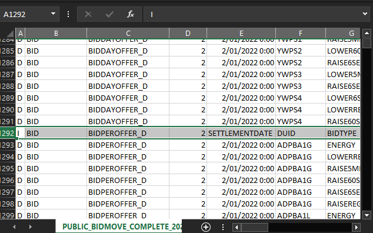

# AEMO Data App


---

## Project Overview

### Project Requirements

_"The project will seek to develop an efficient and effective data extraction process for use by Griffith University’s Centre for Applied Energy Economics and Policy Research (CAEEPR) to extract band-based generator price and supply offer data supplied to the Australian Energy Market Operator (AEMO) as part of the wholesale market operations of the National Electricity Market (NEM)._

_This data includes coupled ($/MWh) price and MWh quantity data supplied to AEMO by generators over ten price/quantity bands that defines each generators piecewise-linear supply function offered to AEMO as required under the National Electricity Rules (NER)._

_The coupled band-based price/quantity data is released in a series of zip files containing csv files relating to supply offers of all generators competing in the NEM that are located in Queensland, New South Wales, Victoria, South Australia and Tasmania and includes thermal, hydro and renewable energy generators._

_Information relating to the time and frequency of changes in the generator price and quantity bands is depicted in the csv files and would have to be extracted from time stamps included in the files that identify when changes occur and what price/quantity changes were invoked. Given the large number of generators involved, high frequency of changes, and substantial time over which the NEM has been running (since 1998), this project would be addressing a large data problem._

_To-date, CAEEPR has not attempted to extract this data but realise it will be very valuable for future research undertaken at CAEEPR, principally permitting different bidding strategies linked to observed behaviour of generators to be investigated. Thus, the project team is likely to have considerable flexibility in determining how to extract this data, consistent with the broad CAEEPR objectives to be listed below._

_The key objectives being sought by CAEEPR is: (1) a set of code that can read in the csv files obtained from AEMO; (2) extract the data in a convenient format to be determined by the project team in consultation with CAEEPR; and (3) enable a search to be undertaken to extract band-based supply-offer bids (e.g. both price and quantity couples) of one or more generators and with this extraction process being capable of writing the generator based data to an excel file._

_Another key objective is to minimize 'hands on' activity required by CAEEPR staff in the actual extraction process. As mentioned above, a capability should be embedded in the software whereby CAEEPR staff can supply one or more generator identifiers consistent with AEMO identifier protocols and the band-based data is extracted and copied to an excel file for that generator or spreadsheets in an excel work file for a set of generators._

_Desirable Skills - CAEEPR has no pre-existing requirements although some experience with data analytics, coding/software development and information systems would be advantageous._

_Additional Details - The skills and knowledge gained by the individual/team would be of particular interest to companies operating in the electricity industry including generation and network companies as well as Government regulatory bodies and departments._

_There is also the prospect of post-graduate level projects particularly addressing Java program optimization to enhance the ability to employ Monte Carlo sampling methods and multi-threads or parallel processing within the structure of the current model software."_

[CAEEPR (2022)](https://www.griffith.edu.au/griffith-business-school/research/centre-applied-energy-economics-policy-research)

### Data Sources

- [AEMO Market Data - NEMWEB](https://visualisations.aemo.com.au/aemo/nemweb/index.html)
- [Daily Completed-bids Archive](http://nemweb.com.au/Reports/Current/Bidmove_Complete/)
- [Monthly Completed-bids Archive](http://nemweb.com.au/Reports/ARCHIVE/Bidmove_Complete/)

## Application Features

### Import Data and Filter

The app can import `.csv` files that match the AEMO name pattern `PUBLIC_BIDMOVE_COMPLETE_YYYYMMDD` from a root folder. The app also recursively scans for all subfolders to find valid files.


Example folder structure


Import result:  `DUMMY.CSV` and `RANDOM.txt` are not imported.

The user can proceed to narrow down the range of data using the date filter. The user can enter the date input manually or use the built-in calendar.


Date filter operation


Filter result

### Multiple Query Filter

The user can use a combination of multiple `Device Unit Identifiers (DUID)` and `BIDTYPE`.


After selecting `EXPORT`, the user is prompted with a confirmation dialog and overview of the output data. This provides a quick preview to ensure that the data is as expected and ready for export.


### Data Processing

#### Data Stacking Problem

A single CSV file records 24-hour of bidding data. However, in each file, there are **two different tables** stacking on one another, that represent **two different data types**, which are the _bidding price_ and the _MWh quantity_ together forming _"the coupled band-based price/quantity data"_.

AEMO refers the two tables as `BIDDAYOFFER_D` and `BIDPEROFFER_D`.


The cut-off point of the two tables is different for each CSV file since the recorded data varied significantly everyday. For example, on `2022/01/02`, the cut-off occurred at row `1292`.



The app attempts to dynamically identify and separate the two different data tables. In the case of multiple CSV files, *i.e., in 1-week range (7 files)*, the process is applied **chronologically** to individual file *(1-day data)*, before compiling all the **post-processed** data into final output.


Example output


Notice how the `Price` sheet displays `PRICEBAND` for bidding price data, while the `Quantity` sheet displays `BANDAVAIL` for the MWh quantity data.

#### Data Duplication Problem

The AEMO records and updates data in a 5-minute interval regardless of changes occurred. Every 5 minutes, there will be **at least** one entry added per **one** `DUID` and **one** `BIDTYPE`.


However, since there are well over 1000 unique `DUIDs` being monitored daily, this results in the raw CSV containing over **300,000** entries **per day**, each file takes around **70MB** of disk storage.


Although equipped with a large amount of data, most of the raw CSV provide little to no useful information, since it is difficult to detect actual data fluctuation and draw meaningful insight, as the frequency of data change is rather small *(not to mention there are repeated entries for `BIDTYPE`)*.

It is estimated that only around **1%** of the data entries present useful information to CAEEPR while the rest **99%** are duplication.

The app aims to solve this problem by detecting and filtering non-changing entries, by checking a combination of different attributes such as `LASTCHANGED`, `BANDAVAIL`, `PRICEBAND`, etc.

An example query of 2 `DUID` and 3 `BIDTYPE` in a range of 3 days *(over **1 million** rows of raw data)* returns a **12KB** Excel file *(size reduced nearly by **18000 times** from 3 raw CSVs)* with a total of **69** rows for both price and quantity data *(about **96%** debloated)*.


### Output and Export

The app exports the final output to Excel `.xlsx` file format.

The app provides *optional* features to specify a custom output name **and/or** a custom save location. If both options are left empty, by default, an `output.xlsx` file will be generated in the same folder that the app is executed from.


Export config


Output result

Please be aware that in most cases, the app will attempt to **overwrite** any existing `.xlsx` files that have the **same** file name.

For example, if you leave custom name empty, any subsequent run of the app will export to the `output.xlsx` file, and the data from previous runs will be **overwritten** by data from the new run.

Thus, it is highly recommended to specify an unique custom name for each run to avoid data loss.

### Error Handling and FAQs

- No root folder specified.

  
- Wrong date format.

  
- Try export with no CSV.

  
- Check for empty output.

  
- Q: What happens if I leave DUID input empty?

  A: The app exports **all** DUID data, with duplication removal, DUID grouping, and chronological sort. This is a good method to only trim/debloat the raw data.
- Q: What happens if I leave BIDTYPE input empty?

  A: Selecting a DUID while leaving BIDTYPE empty will export **all** bid types for that DUID, with duplication removal, BIDTYPE grouping, and chronological sort.
- Q: I tried exporting all DUID, but the output was not sorted chronologically?

  A: For export of multiple DUIDs with period more than 1-day, the output will **first** be grouped into sections by DUID, **then** in each DUID block, the rows are **sorted** chronologically by SETTLEMENTDAY.
- Q: I tried putting the character `/` in the output file name?

  A: The app trims "troublesome" characters in the output name. The character `/` which has the side-effect of creating a new subfolder, is one example. Therefore, it is recommended to name output file with alphanumeric characters only to avoid unexpected behaviours.


## Clone and Build

First clone the source code with the following command ([git-scm](https://git-scm.com/) is required on Windows)

```
git clone https://github.com/larryh12/aemo-app.git
```

### Install Required Packages

The source code provides a `1_init.bat` script to install the required Python packages. Latest version of [Python](https://www.python.org/downloads/) and [pip](https://pypi.org/project/pip/) is recommended.

Double-click to run the script. If there are issues, try right-click and `Run as administrator`.

Packages used in this project:

- [pandas](https://pandas.pydata.org/) and [NumPy](https://numpy.org/) for data processing.
- [PySimpleGUI](https://www.pysimplegui.org/) for the GUI.
- [openpyxl](https://openpyxl.readthedocs.io/) for exporting to Excel output.
- [PyInstaller](https://pyinstaller.org/) for building the source code into a Windows executable.

### Build into Executable

The source code provides a `2_build.bat` script to build the source into a Windows `EXE` file.

The script use `PyInstaller` package to build from source, so make sure to have it already installed, either manually or by running the `1_init.bat` script.

### Disclaimer

The original use of these scripts were to speed up development and provide my teammates the option to quickly setup their dev environment.

It is not guaranteed to work as expected on other devices, as there could be differences in Python setup, system PATH, local scope and permissions, etc.

Building the source code is not recommended for most common usages. If you run into issues, I would highly recommend trying the executable releases.

## Changelog and Releases

To get the compiled `EXE`, please visit [Releases](https://github.com/merrecdarkin/Wil-Project-AEMO-CSV-Efficient-Reading-Sorting-and-Export-/releases).

## Team Members

- [Larry Huynh](https://www.linkedin.com/in/larry-huynh-dev/) - Developer
- [Hung Nguyen Khac](https://www.linkedin.com/in/hung-nguyen-khac-066a52222/) - Developer
- [Salman Iqbal](https://www.linkedin.com/in/salman-iqbal-56047a155/) - Tester
- [Jayden Kino](https://www.linkedin.com/in/jayden-kino/) - Project Manager
- [Thomas Doohan](https://www.linkedin.com/in/thomasdoohan/) - Client Liaison
